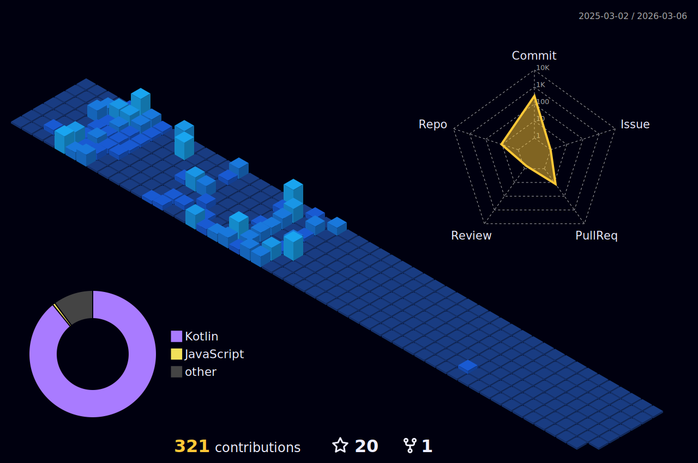

  

# 💫 About Me:
🔭 I’m currently working on Kotlin Educational (https://github.com/khnychenkoav/KotlinEducational.git) and Plant Disease Detector (https://github.com/khnychenkoav/PlantDiseaseDetector.git) 👯 I’m looking to collaborate on Kotlin Educational (https://github.com/khnychenkoav/KotlinEducational.git) 🌱 I’m currently learning Kotlin Multiplatform and Android System Development ⚡ I really like playing guitar and armwrestling

# 📖 Kotlin Educational:
<h3>A growing, hands-on Kotlin learning repository focused on programming fundamentals, data structures, and algorithmic thinking</h3>

<h2>🌐 Visit the Official Kotlin Educational Website and GitHub</h2>

  
  

## 🖥 Socials:

  
  

 

 

# 💻 Tech Stack:
                                         

  

  
  

# 📊 GitHub Stats:
 
 

## 🏆 GitHub Trophies

### ✍️ Random Dev Quote

---

<!-- Proudly created with GPRM ( https://gprm.itsvg.in ) -->
